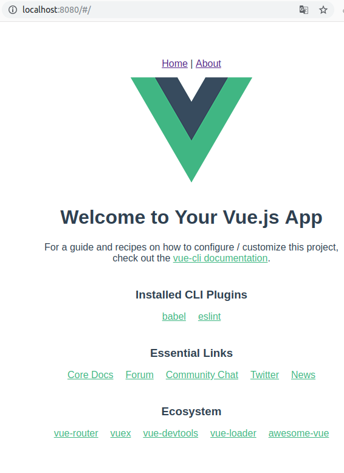
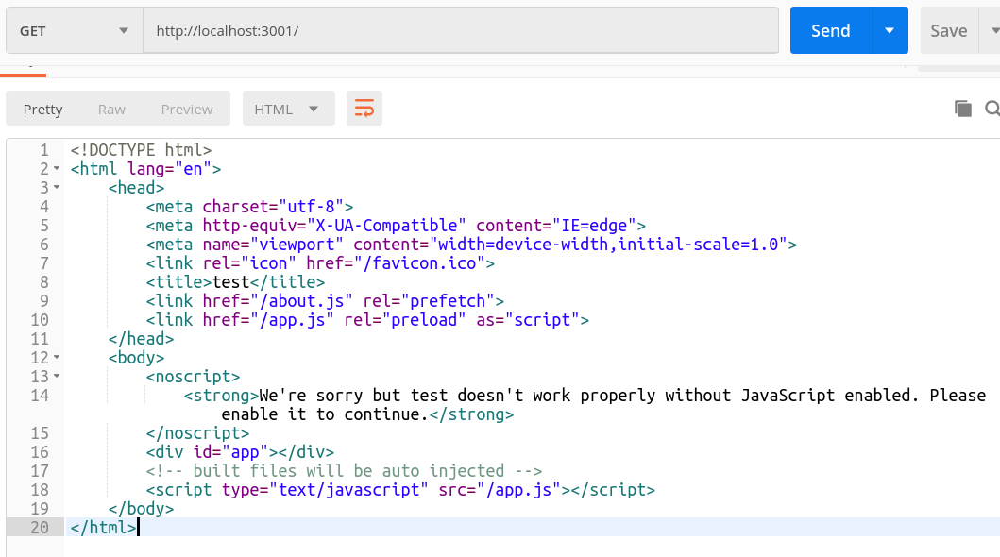
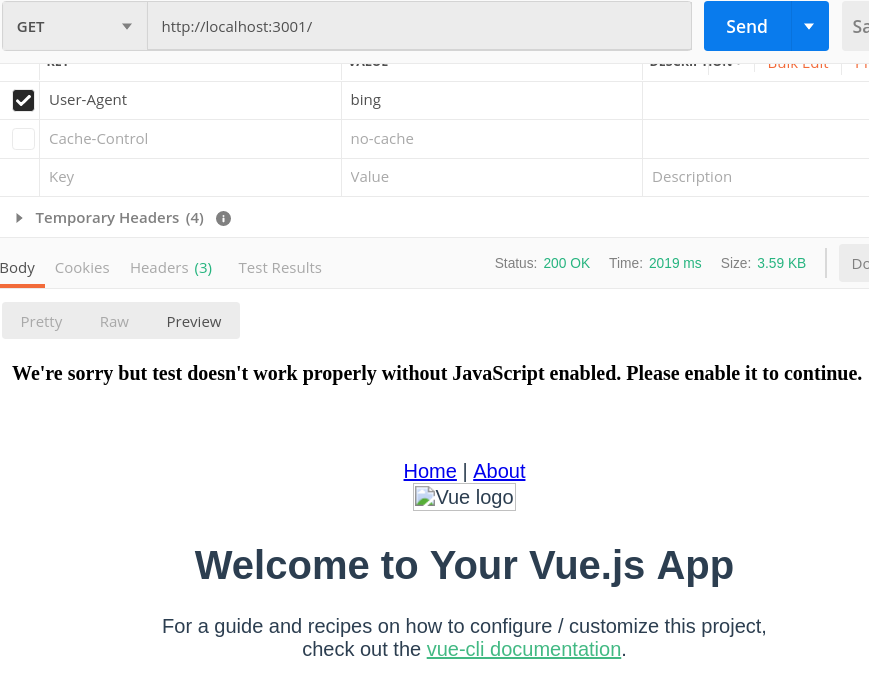
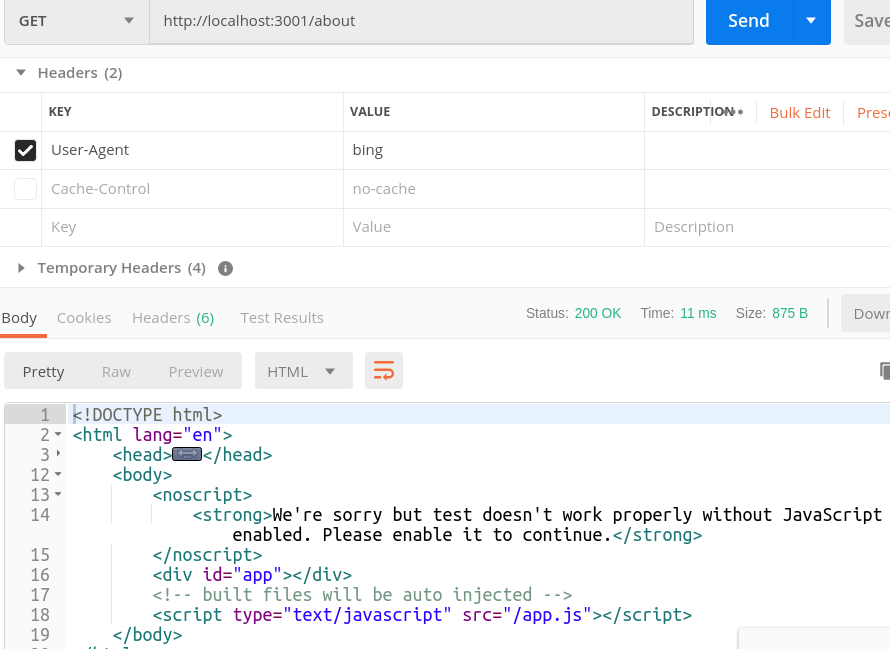

# 前言

本文章写于 2019-07-05 请注意时效性。

有关 SPA 项目的 SEO 友好的解决方案其实不多, 常见的解决手段如下:

1. 将 SPA 项目改为 SSR 渲染
2. 使用预渲染

前者非常稳定但是对于已有的 SPA 项目进行改造需要注意的问题有很多而且耗时长与重写一个没有太大区别，后者只能对于那些"无论是哪种用户访问返回的结果都一样"的页面合适处于十分被动的情况。

总的来说都是十分的繁琐，不过依然有可以避开修改原有代码的解决方案, 例如下面的这个：

> https://www.cnblogs.com/lipten/p/9609678.html

这些方案的基本原理就是，使用代理服务器区分搜索引擎的爬虫和普通用户从而实现针对性内容响应，普通用户响应原有的 SPA 项目也就是“纯粹的 index.html 页面”，而对于爬虫响应对应路由下的渲染好的HTML页面。


既然各位智慧无穷的网友开出了药方，看来我们需要手动熬制了。不过先慢着看看 github 有什么现成的药没有:


没错实际上已经有了现成的解决方案。

# Rendora 简介

**Rendora** 本身是一个代理服务器使用 GO 语言编写专门被设计与解决 SPA 项目的 SEO 处理，支持配置文件以及对外接口。

使用 Rendora 可以相较于其他方案有如下的优势:

1. 无需修改原有项目
2. 无需修改构建配置
3. 支持任意路由页面的渲染
4. 不受限于前端框架与所使用到的技术
5. 搜索引擎爬虫和普通用户获取到的数据一致

它的基本原理就是请求经过 **Rendora** 的时候它会根据请求头 `user-agent` 来判断请求是属于爬虫还是普通用户, 普通用户直接代理到原有的Web服务器, 而爬虫的请求会经过无头浏览器(head-less browser) 处理生成一张页面返回给爬虫，而这个页面的内容就是一副 DOM 快照。


明白了基本原理后我们不难想到只要是异步加载数据然后再利用数据渲染内容的页面都适用。而且爬虫和普通用户两者最终获取到的数据可以高度一致。

# 安装

[Rendora](https://github.com/rendora/rendora) 官方文档中已经给出了安装方式，我就在这里直接照搬了，不过 Rendora 本身是由 GO 语言编写，而且依赖了无头浏览器还是有许多小坑要踩的。

在本文中我使用的系统是 Ubuntu18.04桌面版 ，但是其他的系统用户 windows 和 macos 都是可以安装以及使用的，安装 Rendora 方式稍有不同但是基本概念都是一致的。

## 基本依赖

1. 需要安装 `Golang` 1.11或者更高的版本
2. 需要安装 `chromium` 浏览器或者 `google-chrome` 浏览器，要确保可以在环境变量中可以访问到他们

## 安装 Rendora

[项目地址](https://github.com/rendora/rendora)

安装方式:

```bash
git clone https://github.com/rendora/rendora
cd rendora
make build
sudo make install
```

另外你还可使用使用 docker:

```bash
docker run --net=host -v ./CONFIG_FILE.yaml:/etc/rendora/config.yaml rendora/rendora
```

**注意**: `make build` 过程中会访问网络, 其中有些地址无法在国内访问这会导致构建失败, 国内用户没有开启代理的可以尝试在构建执行如下两条命令进行代理:

```bash
# 启动 go modules 特性
export GO111MODULE=on
# 设置 GOPROXY 为环境变量
export GOPROXY=https://goproxy.io
```

同样的其他平台的可以参考 [goproxy.io](https://goproxy.io/) 的官方指导.

# 编写配置文件

Rendora 是基于配置文件运行的, 在运行前我们需要熟悉一下配置文件.

[配置手册](https://rendora.co/docs/)

配置文件支持多种格式, 这里我就使用 Web 端最常见的 JSON 格式, 需要注意 Rendora 不会检查拼写错误, 请多多复制.

默认情况下我们只需要指定2个参数就可以了:

```json
{
    "backend": {
        "url": "http://127.0.0.1:8000"
    },
    "target": {
        "url": "http://127.0.0.1"
    }
}
```

| 参数    | 含义                     |
| ------- | ------------------------ |
| backend | 原来向用户提供服务的地址 |
| target  | 无头浏览器请求的地址     |

请注意: 因为 Rendora 本质上是一个代理服务器也会启动端口监听(默认3001端口), 这两个参数具体填写的内容取决于后端技术的组合, 例如一个常见的技术组合可能是下面这个样子:

```
nginx->Rendora->App Server
```

但也有可能是反过来的:

```
Rendora->nginx->App Server
```

例如: 我在本地的服务器上监听了80端口用于托管项目的静态文件, 那么实际上这两个参数的配置是一样的, 因为原有的地址和浏览器请求的地址是一致的.

此外为了避免和本地的端口冲突这里还有两个选项是需要注意的:

```json
{
  "listen":{
    "port":3001
  },
  "headless":{
    "internal":{
      "url":"http://localhost:9222"
    },
  },
}
```

- `listen.port` 指的是 Rendora 监听的端口号
- `headless.internal.url` 指的是无头浏览器的请求的地址

此外 Rendora 还可以配置两种过滤器:

1. 请求过滤器 - 决定哪些请求是经过无头浏览器渲染后的, 哪些请求被转发
2. 路径过滤器 - 只有符合请求请求过滤器的请求才会经过路由过滤器, 只有符合路径过滤过滤器规则的请求才会允许通过.

一个常见的请求过滤器例子如下:

**注意**:不要复制注释

```json
---
  "filters":{ // 请求过滤器 通过过滤的使用无头浏览器渲染
    "userAgent":{
      "defaultPolicy":"blacklist", // 匹配策略 黑名单模式(默认所有请求无法通过过滤器)
      "exceptions":{ // 只有符合下列规则的请求才会通过过滤
          // 只要 user-agent 中含有下列字符之一就符合匹配条件
        "keywords":["bot", "bing", "yandex", "slurp", "duckduckgo","baiduspider","googlebot","360spider","Sosospider","sogou spider"]
      },
      // user-agent 完全匹配下方内容的也可以通过
      "exact":["Mozilla/5.0 (X11; Linux x86_64) AppleWebKit/537.36 (KHTML, like Gecko) Chrome/70.0.3538.67 Safari/537.36"]
    }
  }
---
```

加上地址过滤器:

```json
---
"paths":{ // 路径过滤器 符合规则的才会被无头浏览器渲染
      "defaultPolicy": "whitelist", // 白名单模式 所有的请求默认都会通过过滤器
      "exceptions":{ // 除了符合下列规则的会被无视
        "prefix":["/home"], // 前缀匹配
        "exact":["/hello/world"] // 完整匹配
      }
    }
---
```

## 关键参数 `headless.waitAfterDOMLoad`:

一个 SPA 项目中的 DOMLoad 事件触发并不意味着页面渲染完成, 因为网络请求还未完成内容还未渲染到实际的 DOM 中.

而 Rendora 默认情况下 DOMLoad 后就输出 DOM 快照的, 所以我们需要手动指定一个 DOMLoad 完成后的延时时间, 到了这个时间后才会获取快照.

不同项目的初次加载完成不同, 具体延时多少毫秒可以使用 chrome 的 network 面板测量, 这里我使用了延时2秒也就是2000毫秒, 这个配置可以在下方的完整例子中找到.

另外 Rendora 还会忽略掉几乎全部的资源文件的加载(可配置请参考文档)实际情况中会比用户浏览器的加载速度快一些.

完整的例子:

```Json
{
  "listen":{
    "port":3001
  },
  "target":{
    "url":"http://localhost:8080"
  },
  "backend":{
    "url":"http://localhost:8080"
  },
  "headless":{
    "internal":{
      "url":"http://localhost:9222"
    },
    "waitAfterDOMLoad":2000
  },
  "filters":{
    "userAgent":{
      "defaultPolicy":"blacklist",
      "exceptions":{
        "keywords":["bot", "bing", "yandex", "slurp", "duckduckgo","baiduspider","googlebot","360spider","Sosospider","sogou spider"]
      },
      "exact":["Mozilla/5.0 (X11; Linux x86_64) AppleWebKit/537.36 (KHTML, like Gecko) Chrome/70.0.3538.67 Safari/537.36"]
    },
    "paths":{
      "defaultPolicy": "whitelist",
      "exceptions":{ 
        "prefix":["/about"], 
        "exact":["/active/123"]
      }
    }
  }
}
```

# 运行

## 启动无头浏览器

我们使用刚才的配置进行运行, 首先启动无头浏览器:

```bash
# chromium 版本
chromium-browser --headless --disable-gpu --remote-debugging-port=9222
# google-chrome 版本
google-chrome --headless --disable-gpu --remote-debugging-port=9222
```

## 启动项目

然后启动我们的项目, 这里我使用 `vue-cli3` 创建了一个默认的项目并且以开发模式启动,该项目监听了8080端口:

```bash
npm run serve
```

图片:浏览器中表现



## 启动 Rendora

```bash
rendora --config ./config.json
```

## 测试

先使用 postman 进行无 header 请求一次查看 `/` 路径下返回的具体内容, 注意我们这里请求的是 Rendora 开启的 3001 端口而不是项目的 8080 端口.

图片: 没有使用 header 请求的结果:



从图片中可以看到页面还没有任何渲染结果.

这次请求的时候添加上 `user-agent` header 并且查看输出结果.

**图片**: 添加 header 后的输出:



此时你可以明显感觉到响应有延时, 随后输出了页面的内容, 不过这种延时不是一直存在的 Rendora 会对该地址下的内容进行缓存随后的访问中讲不会进行任何渲染,并且你可以指定缓存时间, 另外你还可以将缓存移动到 redis 中进行管理.

我们还可以尝试被配置中被禁止访问的 `/about`:



此时可以看到被拦截的 `/home` 地址返回的是原有的页面内容而不是渲染好的页面。

# 相关内容 & 参考

> http://www.runtester.com/detail/blog/20
>
> https://github.com/rendora/rendora
>
> https://github.com/rendora/rendora/issues/14